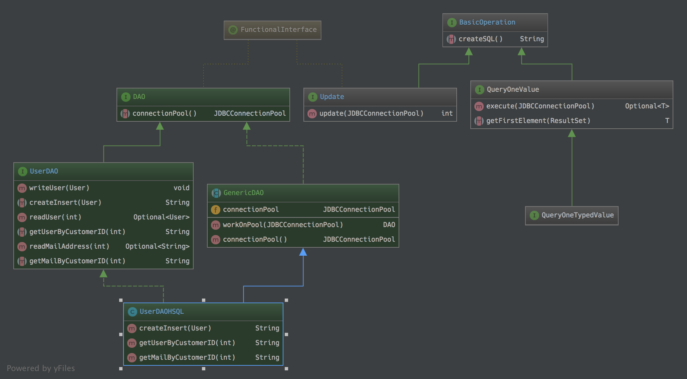

# JDBC-DAO - a minimalistic JDBC based DAO

Sometimes you have a small project with a minimal database and you don´t want to 
start with one of the big ORM frameworks.
For this I extracted the few classes here to give a minimalistic base.

Feel free to use.  If you have any comments...  @SvenRuppert or sven.ruppert at gmail

## The short version




## Example

For this example (you could find it in the src-test folder)
 I created a class "User" We could call it our model.
 
 ```java
 public class User {
 
   private final Integer customerID;
   private final String firstname;
   private final String lastname;
   private final String email;
   //SNIPP
 ```

btw: For this implementation the JDBC Connection Pool HikariCP is used.

```xml
    <dependency>
      <groupId>com.zaxxer</groupId>
      <artifactId>HikariCP</artifactId>
    </dependency>
```
So, lets define the minimum we need for every Operation, a SQL String.
For this we are defining the method ***String createSQL()***.

```java
@FunctionalInterface
public interface BasicOperation {

  String createSQL();
}
```

With this we could start to define all the generic JDBC stuff we need for our project.
Maybe a generic ***Update*** Operation. 

```java
@FunctionalInterface
public interface Update extends BasicOperation {

  default int update(final JDBCConnectionPool connectionPool) {
    final HikariDataSource dataSource = connectionPool.getDataSource();
    try {
      final Connection connection = dataSource.getConnection();
      final int count;
      try (final Statement statement = connection.createStatement()) {
        final String sql = createSQL();
        count = statement.executeUpdate(sql);
        statement.close();
      }
      dataSource.evictConnection(connection);
      return count;
    } catch (final SQLException e) {
      e.printStackTrace();
    }
    return -1;
  }

}
```

This implementation is only the generic part from the technical point of view.
It combines the Connection-Pool with the JDBC-statement to execute a SQL command.
Nothing more happened here. I implemented this as an interface with a default implementation, 
so we could combine later command implementations if we would like.

One thing all DAO classes will have, is the possibility to get an Connection-Pool
to execute SQL Commands.

```java
@FunctionalInterface
public interface DAO {
  JDBCConnectionPool connectionPool();
}
```

Now, lets have a look at the part that will combine this with the model. (Class User)
To implement a DAO you don´t have to extend a class. Just define the methods you need.
We are using this interface only to describe the RDBMS Vendor independent things.

In this case, the method ***writeUser*** in combination with the 
method signature ***createInsert***

```java
public interface UserDAO extends DAO {

  default void writeUser(final User user) {
    ((Update) () -> createInsert(user)).update(connectionPool());
  }

  String createInsert(User user);

  //SNIPP
}
```

Here I divided the task into two parts. 
Part number one is the definition of an ***Update*** operation with the 
reference to the method that will create a SQL String based on the User.
Part number two is the invocation of the method update itself and the Connection-Pool 
that must be used. ( method definition ***connectionPool()*** )

How to get the ConnectionPool is not defined here. This is a technical part, based on the project 
and the possibilities there. It could be static or Dependency Injection or.. 

Until now we have no RDBMS vendor specific code written.

The next step will be an infrastructure step. It will combine the right ConnectionPool.
Now we nee to hold the instance, that will force us to make a abstract class out of it.

```java
public abstract class GenericDAO implements DAO {

  private JDBCConnectionPool connectionPool;

  public UserDAOAbstractImpl workOnPool(final JDBCConnectionPool connectionPool) {
    this.connectionPool = connectionPool;
    return this;
  }

  @Override
  public JDBCConnectionPool connectionPool() {
    return connectionPool;
  }

}
```
This abstract class only presents a way, how to connect the ConnectionPool with the DAO itself.
In this example we are using a set-method (***workOnPool***). But it could be an @Inject as well.

Now it is time to write the SQL for your RDBMS.
```java
public class UserDAOHSQL extends UserDAOAbstractImpl 
                         implements UserDAO {

  public String createInsert(final User user) {
    final String sql = "INSERT INTO CUSTOMER " +
        "( CUSTOMER_ID, FIRSTNAME, LASTNAME, EMAIL ) " +
        " VALUES " +
        "( " +
        user.getCustomerID() + ", " +
        "'" + user.getFirstname() + "', " +
        "'" + user.getLastname() + "', " +
        "'" + user.getEmail() + "' " +
        ")";
    return sql;
  }

  //SNIPP
}
```
Here we are implementing a HSQL version of this DAO. 
The only thing is the transformation of the User to the SQL String.
If we would like to have an Oracle version of this, 
we could create a class ***UserDAOOracle***

Finally we are done.
Based on this we could realize jUnit tests that are working with the UserDAO interface.
With this we are able to define one test and see if every implementation will have the same behavior.

In this project I gave you an example how to start an In-Memory HSQL DB to deal with jUnit.
Feel free to use, and let me know what you are thinking about it.

Have in mind, that this is only a very small implementation 
and nothing you should compare with frameworks like JOOQ or Speedment or JPA or..
But it is easy to use ;-)

Feel free to change and extend..  ;-)

If you have questions, the best easiest ways to reach me are

mail: sven.ruppert (at) gmail.com or Twitter @SvenRuppert
